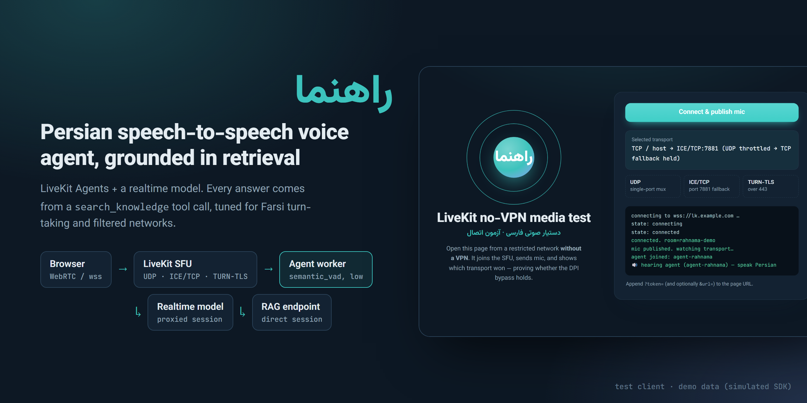
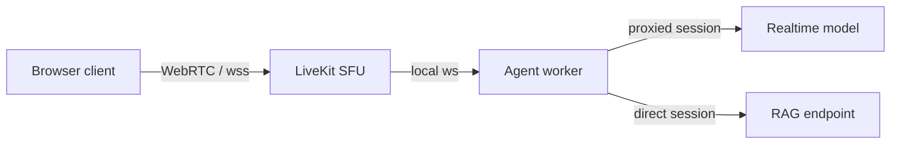
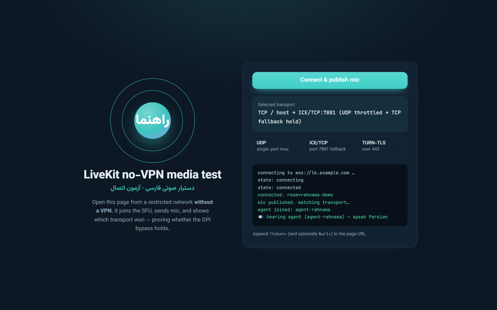
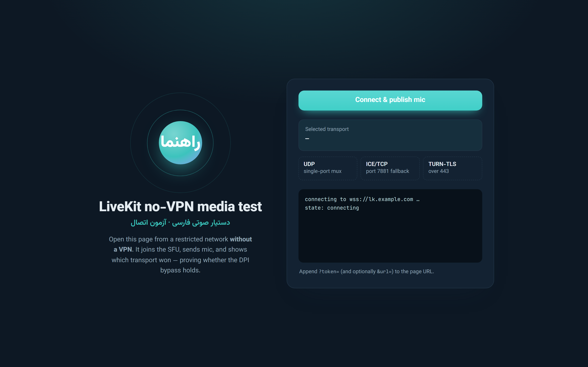
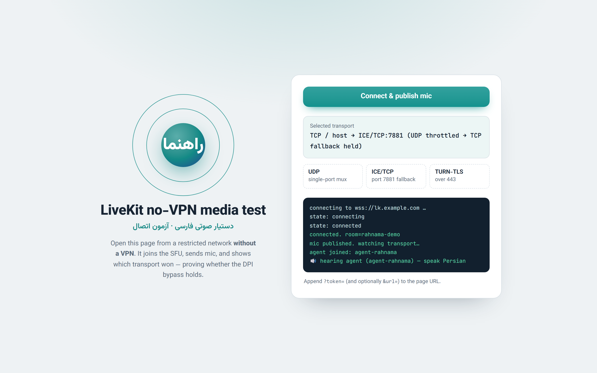
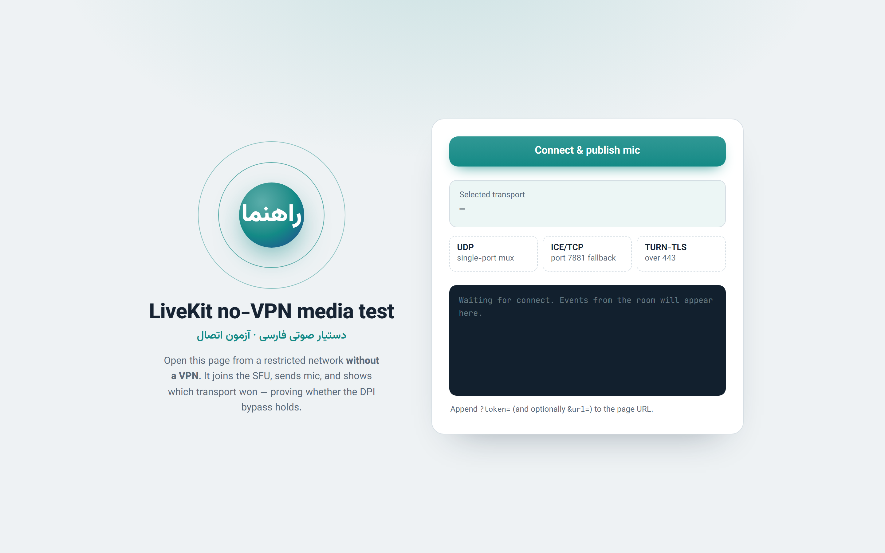
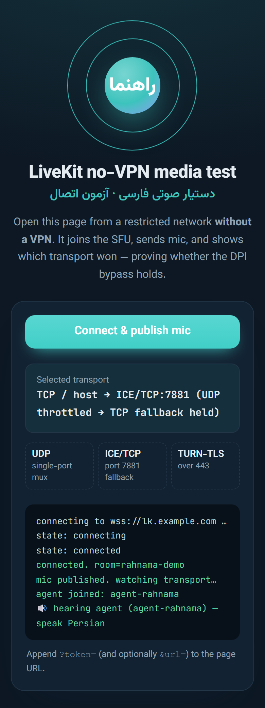

# livekit-fa-agent



**Rahnama (راهنما): a Persian voice agent that talks back in real time and answers only from retrieved passages, built to work on filtered networks.**


A Persian (Farsi) speech-to-speech voice agent built on LiveKit Agents and a realtime model. Every answer is grounded in passages returned by a retrieval tool.

## Highlights

- Speech-to-speech in Persian over WebRTC, with RAG through a `search_knowledge` tool call.
- Turn-taking tuned for Farsi pauses (`semantic_vad`, low eagerness).
- Split proxying: model traffic proxied, RAG and SFU links direct.
- Self-hosted LiveKit with a UDP → ICE/TCP fallback (TURN-TLS/443 drafted in `infra/livekit.yaml`, not yet enabled), plus a browser client that reports which transport won.
- Idle-close cost guard and per-turn metrics.

## Why it's interesting

- **Grounded voice answers.** The persona prompt forces a `search_knowledge` tool call before any religious answer and forbids adding outside knowledge. The tool returns capped, ordered passages, or explicit sentinels (`(no relevant passages found)`, `(knowledge base unavailable)`) that the prompt maps to spoken fallbacks (`agent/worker.py`).
- **Farsi turn-taking.** Uses `semantic_vad` with `eagerness="low"` so Persian pauses are not clipped, and `interrupt_response=False` so noise or echo cannot cancel a long answer mid-RAG-wait. The worker comments record the failures that led to each choice.
- **Per-plugin proxying for restricted networks.** A global `HTTPS_PROXY` would also tunnel the LiveKit worker's SFU registration. Instead only the realtime model's `http_session` uses the proxy, the RAG call uses a separate proxy-free session, and `WorkerOptions(http_proxy=None)` keeps the SFU link direct (`agent/worker.py`, `agent/proxy.py`).
- **Load by job count, not CPU.** A custom `load_fnc` avoids the worker flapping to "unavailable" when CPU-based load oscillates around the threshold.
- **Cost guard.** Idle-close after the user goes away stops realtime billing on abandoned tabs; per-turn metrics and session usage are logged.

## Architecture



The browser joins a LiveKit room on a self-hosted SFU (`infra/`). The worker joins the same room over localhost. Audio goes to the realtime model through the proxy; retrieval goes direct.

## Tech stack

Python, `livekit-agents`, `livekit-plugins-openai` (realtime), aiohttp, httpx, nginx, self-hosted LiveKit server.

## Key techniques

- Tool calling for retrieval: `search_knowledge` in `agent/worker.py`.
- Prompt design for a voice UX: short, persona-labelled rules; no spoken citations or markdown.
- Transport tuning for lossy networks: UDP single-port mux plus ICE/TCP fallback (`infra/livekit.yaml`), wss via nginx (`infra/*.conf`).
- Test client that reports the selected ICE transport (light/dark, mobile-friendly): `client/index.html`.

## Getting started

```bash
pip install livekit-agents livekit-plugins-openai openai aiohttp httpx
cp .env.example .env          # fill in values
set -a; . ./.env; set +a      # worker reads plain env vars (no dotenv)
python agent/worker.py dev
```

You need a LiveKit server (see `infra/livekit.yaml`, replace the placeholder keys), an OpenAI key, a local HTTP proxy if your network blocks the model API, and a retrieval endpoint that accepts `POST {"query": "..."}` and returns `{"nodes": [{"text": "..."}]}`. For the test client, serve `client/` over HTTPS next to `livekit-client.umd.min.js` and open it with `?token=<room token>`.

## Tests

None yet; behaviour was checked by hand against a live deployment.

## Screenshots

All screenshots show the real `client/index.html` with a simulated LiveKit SDK (demo data: no SFU, token or agent involved).

| Connected, transport detected | Connecting |
|---|---|
|  |  |
| **Light theme, connected** | **Idle** |
|  |  |

<p align="center"></p>

To regenerate: serve the client with `python -m http.server 4100 --bind 127.0.0.1 --directory client`, then run `node scripts/capture-screenshots.js` (needs Playwright). The hero banner is `scripts/hero.html`.

## License

MIT

---

<sub>Built by <a href="https://sepehrradmard.ir">Sepehr Radmard</a> · <a href="https://www.linkedin.com/in/sepehr-radmard/">LinkedIn</a> · <a href="https://github.com/sepehr071">GitHub</a> · more projects on my <a href="https://github.com/sepehr071">profile</a></sub>
